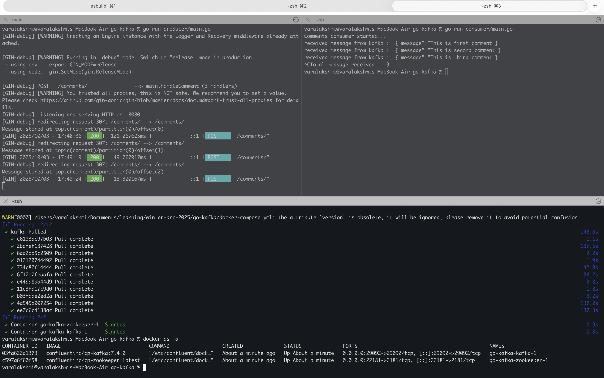

## Kafka implemntation with Go

## How to Run:

#### 1. Pull the docker image
command : `docker-compose up -d`

#### 2. Run the Producer
command: `go run producer/main.go`

#### 3. Run the consumer
commmand: `go run consumer/main.go`

### Use the Curl to send a request:
```curl
curl --location 'http://localhost:8080/comments' \
--header 'Content-Type: application/json' \
--data '{
    "message": "This is third comment"
}'
```

### Output
